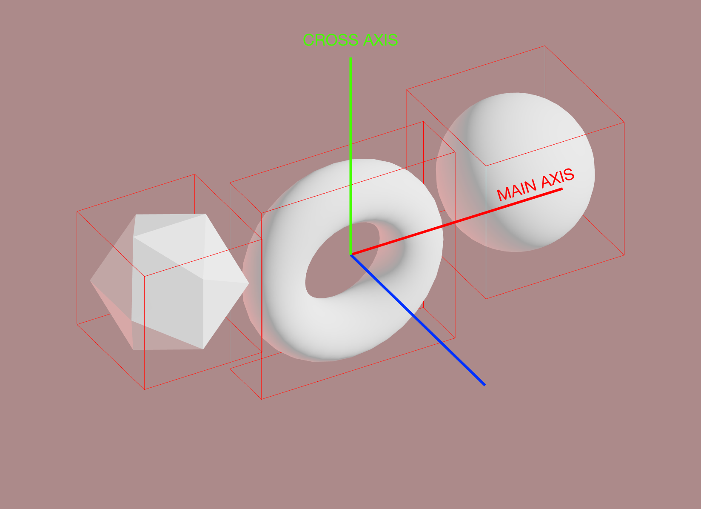

[](https://travis-ci.org/react-spring/react-three-flex) [](https://badge.fury.io/js/react-three-flex) 

This library brings the webs flexbox spec to [react-three-fiber](https://github.com/react-spring/react-three-fiber). It is based on [yoga](https://github.com/facebook/yoga), facebooks open source layout engine for react-native. You might be wondering why. But then again, placing content in threejs is hard. Think of how you would normmaly go about making stuff rensponsive, stick to the sides, wrap around, grids, rows, columns, padding, margin. Especially if you are working on frontend centric projects where the camera is pointing down, forming a 2-dimensional view.

You can try a live demo here: ...

```bash
npm install react-three-flex
```

## Usage

The layout works with two components, `<Flex />` as container and `<Box />` as a wrapper for 3D objects.

You simply wrap your 3D objects in different `<Box />` instances inside a flex container. This way they will be automatically placed in the 3D space, just like a DOM Flexbox.

```jsx
import { Flex, Box } from 'react-three-flex'

const Layout = () => (
  <Flex justifyContent="center" alignItems="center">
    <Box>
      <mesh geometry={box} />
    </Box>
    <Box flexGrow={1}>
      <mesh geometry={torus} />
    </Box>
    <Box>
      <mesh geometry={sphere} />
    </Box>
  </Flex>
)
```

You can tweak the container and the boxes using standard CSS flex properties, like `flexDirection` or `justifyContent` for the container and `flexGrow` for the boxes. There are also _shorthands_, like `align` and `justify`. See props docs below for more info.

### Sizing

The main difference between a DOM Flexbox and react-three-flex is that you don't have a parent container for the root flex, so you'll need to specify its dimensions using `size` prop, if you want it to be centered and perform grows or wrapping.

```jsx
<Flex flexDirection="row" flexWrap="wrap" size={[300, 200, 0]}>
  <Box>
    <mesh geometry={sphere} />
  </Box>
  <Box>
    <mesh geometry={torus} />
  </Box>
  <Box>
    <mesh geometry={icosahedron} />
  </Box>
</Flex>
```

**⚠️ WATCH OUT!** Yoga flexbox engine uses integer numbers to perform layout calculation, so to preserve precision make sure you choose big enough numbers for sizes.


### Axis Orientation

Another important difference with DOM Flexbox is that you can specify the direction of the container in 3D, using an axis and its normal. The elements will be positioned in the 2D plane given by the axis and normal.

In fact, the 2D flex container width and height will be calculated looking at the `size` prop with respect of the chosen axes (200 and 100 in this example).

```jsx
<Flex mainAxis="z" crossAxis="y" size={[0, 100, 200]}>
  {/* ... */}
</Flex>
```



### Margin and Padding

For every `<Flex />` and `<Box />` component you can specify the margin and padding like in DOM flexbox.

```jsx
<Flex flexDirection="row" size={[300, 200, 0]} padding={30} margin={5}>
  <Box padding={5} margin={5}>
    <mesh geometry={sphere} />
  </Box>
  <Box padding={5} margin={5}>
    <mesh geometry={torus} />
  </Box>
</Flex>
```


### Nesting

Since a `<Flex />` component works the same way as a DOM one, you can easily make complex layouts by nesting flex containers.

```jsx
<Flex flexDirection="row" flexWrap="wrap" size={[50, 0, 0]}>
  <Box>
    <mesh geometry={sphere} />
  </Box>
  <Box>
    <Flex flexDirection="column" flexWrap="no-wrap">
      <Box>
        <mesh geometry={sphere} />
      </Box>
      <Box>
        <mesh geometry={box} />
      </Box>
    </Flex>
  </Box>
</Flex>
```

## API

```jsx
<Flex
  size={[1, 1, 1]}                    // Total size of the flex container, see above
  position={[0, 0, 0]}                // Default - position for the flex container in the scene
  yogaDirection={Yoga.DIRECTION_LTR}  // Default - right to left or right to left
  mainAxis="x"                        // Default - plane axis, see above
  crossAxis="y"                       // Default - plane normal axis, see above
  {...R3FlexProps}                    // Standard Flexbox props, described below
>
  <Box>
    {/* ... */}
  </Box>
</Flex>
```

### Flexbox props

Both `<Flex/>` and `<Box />` components shares the same Flexbox props API from Yoga. The library also provides string and number inputs for convenience and shorthands.

```ts
type Align =
  | YogaAlign
  | 'auto'
  | 'baseline'
  | 'center'
  | 'flex-end'
  | 'flex-start'
  | 'space-around'
  | 'space-between'
  | 'stretch'

type JustifyContent =
  | YogaJustifyContent
  | 'center'
  | 'flex-end'
  | 'flex-start'
  | 'space-between'
  | 'space-evenly'
  | 'space-around'

type FlexDirection = YogaFlexDirection | 'row' | 'column' | 'row-reverse' | 'column-reverse'

type FlexWrap = YogaFlexWrap | 'no-wrap' | 'wrap' | 'wrap-reverse'

type R3FlexProps = {
  // Align
  alignContent: Align
  alignItems: Align
  alignSelf: Align
  align: Align // Shorthand for alignItems

  // Justify
  justifyContent: JustifyContent
  justify: JustifyContent // Shorthand for justifyContent

  // Direction
  flexDirection: FlexDirection
  flexDir: FlexDirection // Shorthand for flexDirection
  dir: FlexDirection // Shorthand for flexDirection

  // Wrap
  flexWrap: FlexWrap
  wrap: FlexWrap // Shorthand for flexWrap

  // Flex basis
  flexBasis: number

  // Grow & shrink
  flexGrow: number
  flexShrink: number

  // Height & width
  height: string | number
  width: string | number
  maxHeight: string | number
  maxWidth: string | number
  minHeight: string | number
  minWidth: string | number

  // Padding
  padding: string | number
  p: string | number // Shorthand
  paddingTop: string | number
  pt: string | number // Shorthand
  paddingBottom: string | number
  pb: string | number // Shorthand
  paddingLeft: string | number
  pl: string | number // Shorthand
  paddingRight: string | number
  pr: string | number // Shorthand

  // Margin
  margin: string | number
  m: string | number // Shorthand
  marginTop: string | number
  mt: string | number // Shorthand
  marginLeft: string | number
  ml: string | number // Shorthand
  marginRight: string | number
  mr: string | number // Shorthand
  marginBottom: string | number
  mb: string | number // Shorthand
}
```
